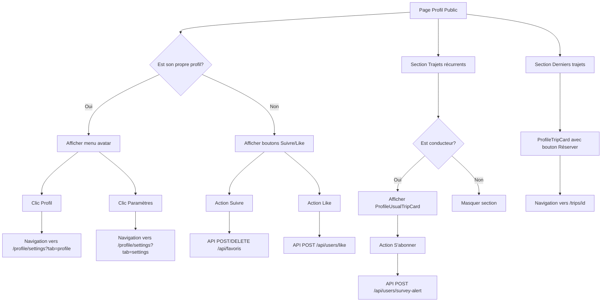

# Plan d'implémentation - Pages Profil Public et Configuration

## Contexte

Ce plan décrit l'implémentation frontend des pages **Profil Public** (`/profile/[id]`) et **Configuration** (`/profile/settings`) en respectant les maquettes fournies et les règles métier spécifiées.

---

## Analyse des maquettes vs code existant

### Maquette Profil Public (Profile Summary)

| Élément | Maquette | Code existant | Action |
|---------|----------|---------------|--------|
| En-tête | Banner + avatar + boutons Suivre/Favori | Banner + avatar + boutons Suivre/Like | ✅ Conforme |
| Identité | Nom + âge + localisation + badge vérifié | Nom + badge vérifié | ⚠️ Ne pas implémenter âge/localisation |
| Résumé sous nom | "Go Score 4.8 · 142 trajets · Localisation" | schoolRole + "à La Cité" | ✅ Déjà implémenté |
| Rôle | Non affiché | Affiché en bleu sous le nom | ✅ Déjà implémenté |
| Bio | Section dédiée | Inline sous les langues | ⚠️ À repositionner |
| Badges | 4 badges circulaires | Non implémenté | ❌ Hors scope |
| Langues | Drapeaux + texte | Tags arrondis | ✅ Acceptable |
| Photo véhicule | Affichée à droite | Affichée en pleine largeur | ⚠️ À ajuster |
| Statistiques | 4 cartes (Go Score, Trajets, Note, CO2) | 3 cartes inline | ⚠️ À ajuster |
| Avis | Section dédiée avec avatars | Section dédiée avec avatars | ✅ Conforme |
| Trajets récurrents | 3 cartes avec S'abonner | ProfileUsualTripCard existant | ✅ Conforme |
| Derniers trajets | Cartes avec Réserver | Cartes simples avec lien | ⚠️ À remplacer par Recommended Trip Cards |

### Maquette Configuration

| Élément | Maquette | Code existant | Action |
|---------|----------|---------------|--------|
| En-tête | Banner + avatar + bouton Configurer | Non implémenté | ⚠️ À ajouter |
| Sidebar | Résumé profil + Bio + Badges + Déconnexion | Non implémenté | ⚠️ À ajouter |
| Onglets | Configuration du profil / Préférences / Accessibilité | Profil / Préférences | ⚠️ À ajuster |
| Formulaire profil | Nom, Âge, Localisation, Langues, toggles visibilité | Nom, Bio, Téléphone, Langue, Langues parlées | ⚠️ À ajuster |
| Véhicule | Section dédiée | Non implémenté | ❌ Hors scope |
| Ambiance | 4 toggles avec icônes | 3 toggles + conversation level | ⚠️ À ajuster |

---

## Architecture des composants

```
features/profile/
├── components/
│   ├── ProfileHeader.tsx          # Nouveau - En-tête avec menu avatar
│   ├── ProfileUsualTripCard.tsx   # Existant - Carte trajet récurrent
│   ├── ProfileStatsCard.tsx       # Nouveau - Carte statistique
│   ├── ProfileVehicleCard.tsx     # Nouveau - Photo véhicule
│   ├── ProfileBioSection.tsx      # Nouveau - Section bio
│   ├── SettingsSidebar.tsx        # Nouveau - Sidebar configuration
│   └── SettingsTabs.tsx           # Nouveau - Système d'onglets
├── hooks/
│   ├── useProfileActions.ts       # Nouveau - Actions profil (like, follow, subscribe)
│   └── useSettingsTabs.ts         # Nouveau - Gestion onglets configuration
└── types/
    └── profile.types.ts           # Nouveau - Types partagés
```

---

## Détail des tâches

### 1. Composant ProfileHeader

**Fichier**: `features/profile/components/ProfileHeader.tsx`

**Responsabilités**:
- Afficher le banner avec photo de fond
- Afficher l'avatar de l'utilisateur
- Menu dropdown avatar avec:
  - **Profil** → Redirige vers `/profile/settings?tab=profile`
  - **Paramètres** → Redirige vers `/profile/settings?tab=settings`

**Props**:
```typescript
interface ProfileHeaderProps {
  avatarUrl?: string;
  firstName: string;
  isOwnProfile: boolean;
  onNavigateToSettings: (tab: 'profile' | 'settings') => void;
}
```

**Comportement**:
- Le menu avatar n'est visible que si `isOwnProfile === true`
- Utilise le pattern dropdown existant du header principal
- Animation d'ouverture/fermeture fluide

---

### 2. Page Profil Public - Modifications

**Fichier**: `app/(protected)/profile/[id]/page.tsx`

#### 2.1 Section Identité

**Modifications**:
- Supprimer l'affichage de l'âge et de la localisation
- Conserver: `schoolRoleLabel(profile.schoolRole) + " à La Cité"`
- Conserver: rôle actuel en dessous du nom
- Déplacer la bio dans une section dédiée sous les langues

```tsx
// Avant
<p className="text-sm text-gray-500">
  {schoolRoleLabel(profile.schoolRole)} à La Cité
</p>

// Après (inchangé - déjà conforme)
<p className="text-sm text-gray-500">
  {schoolRoleLabel(profile.schoolRole)} à La Cité
</p>
<p className="mt-0.5 text-xs font-medium text-blue-600">
  {roleLabel(profile.role)}
</p>
```

#### 2.2 Section Bio

**Nouvelle structure**:
```tsx
{profile.bio && (
  <section className="mb-6">
    <h3 className="text-sm font-semibold text-gray-700 mb-2">Bio</h3>
    <p className="text-sm leading-relaxed text-gray-600 bg-gray-50 rounded-xl p-4">
      {profile.bio}
    </p>
  </section>
)}
```

#### 2.3 Photo du véhicule (conditionnelle)

**Règle**: Afficher uniquement si `isDriver === true`

```tsx
{isDriver && dp?.vehiclePhotoUrl && (
  <section className="mb-6">
    <h3 className="text-sm font-semibold text-gray-700 mb-2">Véhicule</h3>
    <div className="relative h-36 w-full overflow-hidden rounded-2xl bg-gray-100">
      <Image src={dp.vehiclePhotoUrl} alt="Véhicule" fill className="object-cover" />
    </div>
    {dp.vehicleMake && (
      <p className="mt-1.5 text-center text-xs text-gray-400">
        {dp.vehicleMake} {dp.vehicleModel}
      </p>
    )}
  </section>
)}
```

#### 2.4 Section Avis - Réutilisation du composant Reviews

**Approche**: Créer un composant `ProfileReviewsSection` qui réutilise la logique d'affichage des reviews existante.

```tsx
// features/profile/components/ProfileReviewsSection.tsx
import { Review } from "@/features/dashboard/types/review.types";
import { StarRating } from "@/features/reviews/components/ReviewsPage";

interface ProfileReviewsSectionProps {
  reviews: Review[];
}

export function ProfileReviewsSection({ reviews }: ProfileReviewsSectionProps) {
  if (!reviews?.length) return null;
  
  return (
    <section className="mb-6">
      <h2 className="mb-3 text-lg font-bold">
        Avis ({reviews.length})
      </h2>
      <div className="flex flex-col gap-3">
        {reviews.map((review) => (
          <ReviewCard key={review.id} review={review} />
        ))}
      </div>
    </section>
  );
}
```

#### 2.5 Recommended Trip Cards

**Remplacer** la section "Derniers trajets publiés" par des cartes inspirées de `RecommendedRidesSection`.

**Nouveau composant**: `features/profile/components/ProfileTripCard.tsx`

```tsx
interface ProfileTripCardProps {
  trip: PublicTrip;
  onReserve: (tripId: string) => void;
}

export function ProfileTripCard({ trip, onReserve }: ProfileTripCardProps) {
  return (
    <div className="flex items-center justify-between rounded-xl border border-gray-100 bg-white p-4 shadow-sm">
      <div className="flex items-center gap-2">
        <FaLocationDot className="text-blue-500" size={14} />
        <span className="text-sm font-semibold">{trip.departureLabel}</span>
        <FaArrowRight className="text-gray-400" size={10} />
        <span className="text-sm font-semibold">{trip.arrivalLabel}</span>
      </div>
      <div className="flex items-center gap-3">
        <span className="text-xs text-gray-400">
          {formatDate(trip.departureDate)} · {trip.departureTime}
        </span>
        <span className="text-sm font-bold text-blue-600">{trip.pricePerPassenger}$</span>
        <button
          onClick={() => onReserve(trip.id)}
          className="rounded-full bg-blue-600 px-4 py-1.5 text-xs font-semibold text-white hover:bg-blue-700"
        >
          Réserver
        </button>
      </div>
    </div>
  );
}
```

---

### 3. Actions interactives

#### 3.1 Hook useProfileActions

**Fichier**: `features/profile/hooks/useProfileActions.ts`

```typescript
interface UseProfileActionsProps {
  targetUserId: string;
  isLiked: boolean;
  isFavorite: boolean;
  likeCount: number;
  onLikeChange?: (liked: boolean, count: number) => void;
  onFavoriteChange?: (favorite: boolean) => void;
}

export function useProfileActions({
  targetUserId,
  isLiked,
  isFavorite,
  likeCount,
  onLikeChange,
  onFavoriteChange,
}: UseProfileActionsProps) {
  const [likeLoading, setLikeLoading] = useState(false);
  const likeTimeoutRef = useRef<NodeJS.Timeout>();

  // Action Like avec debounce
  const handleLike = useCallback(async () => {
    if (likeLoading) return;
    
    const nextLiked = !isLiked;
    const nextCount = nextLiked ? likeCount + 1 : Math.max(0, likeCount - 1);
    
    // Mise à jour optimiste
    onLikeChange?.(nextLiked, nextCount);
    setLikeLoading(true);
    
    // Debounce pour éviter les clics multiples
    if (likeTimeoutRef.current) clearTimeout(likeTimeoutRef.current);
    
    likeTimeoutRef.current = setTimeout(async () => {
      try {
        await fetch(`/api/users/${targetUserId}/like`, {
          method: "POST",
          headers: { "Content-Type": "application/json" },
          body: JSON.stringify({ liked: nextLiked }),
        });
      } catch {
        // Rollback en cas d'erreur
        onLikeChange?.(isLiked, likeCount);
      } finally {
        setLikeLoading(false);
      }
    }, 300);
  }, [isLiked, likeCount, likeLoading, targetUserId, onLikeChange]);

  // Action Suivre / Ajouter aux favoris
  const handleFavorite = useCallback(async () => {
    const nextFavorite = !isFavorite;
    onFavoriteChange?.(nextFavorite);
    
    try {
      await fetch(`/api/favoris/user-favori`, {
        method: nextFavorite ? "POST" : "DELETE",
        headers: { "Content-Type": "application/json" },
        body: JSON.stringify({ targetUserId }),
      });
    } catch {
      onFavoriteChange?.(isFavorite);
    }
  }, [isFavorite, targetUserId, onFavoriteChange]);

  // Action S'abonner
  const handleSubscribe = useCallback(async (
    departure: string,
    arrival: string,
    driverName: string
  ) => {
    await fetch(`/api/users/${targetUserId}/survey-alert`, {
      method: "POST",
      headers: { "Content-Type": "application/json" },
      body: JSON.stringify({
        driverId: targetUserId,
        driverName,
        departureLabel: departure,
        arrivalLabel: arrival,
      }),
    });
  }, [targetUserId]);

  // Action Réserver
  const handleReserve = useCallback((tripId: string) => {
    window.location.href = `/trips/${tripId}`;
  }, []);

  useEffect(() => {
    return () => {
      if (likeTimeoutRef.current) clearTimeout(likeTimeoutRef.current);
    };
  }, []);

  return {
    handleLike,
    handleFavorite,
    handleSubscribe,
    handleReserve,
    likeLoading,
  };
}
```

---

### 4. Page Configuration - Modifications

**Fichier**: `app/(protected)/profile/settings/page.tsx`

#### 4.1 Structure à onglets avec routage

**Onglets supportés**:
- `profile` → Gestion du profil (nom, bio, langues)
- `settings` → Paramètres (préférences, notifications, ambiance)

**Routage**:
```typescript
// Lecture du paramètre d'URL
const searchParams = useSearchParams();
const initialTab = (searchParams.get("tab") as Tab) ?? "profile";

// Navigation vers un onglet spécifique
const navigateToTab = (tab: Tab) => {
  router.push(`/profile/settings?tab=${tab}`);
  setTab(tab);
};
```

#### 4.2 Sidebar de configuration

**Nouveau composant**: `features/profile/components/SettingsSidebar.tsx`

```tsx
interface SettingsSidebarProps {
  user: MeData;
  onNavigate: (tab: Tab) => void;
  activeTab: Tab;
  onLogout: () => void;
}

export function SettingsSidebar({ user, onNavigate, activeTab, onLogout }: SettingsSidebarProps) {
  return (
    <aside className="w-64 shrink-0">
      {/* Résumé du profil */}
      <div className="mb-6">
        <h3 className="text-sm font-semibold text-gray-400 uppercase">Résumé du profil</h3>
        <p className="font-bold">{user.firstName} {user.lastName}</p>
        <p className="text-sm text-gray-500">{schoolRoleLabel(user.schoolRole)} à La Cité</p>
      </div>

      {/* Bio */}
      {user.bio && (
        <div className="mb-6">
          <h3 className="text-sm font-semibold text-gray-400 uppercase mb-2">Ma Bio</h3>
          <p className="text-sm text-gray-600 bg-gray-50 rounded-xl p-3">{user.bio}</p>
        </div>
      )}

      {/* Navigation onglets */}
      <nav className="mb-6">
        <button
          onClick={() => onNavigate("profile")}
          className={`w-full text-left px-3 py-2 rounded-lg text-sm ${
            activeTab === "profile" ? "bg-blue-50 text-blue-600" : "text-gray-600"
          }`}
        >
          Configuration du profil
        </button>
        <button
          onClick={() => onNavigate("settings")}
          className={`w-full text-left px-3 py-2 rounded-lg text-sm ${
            activeTab === "settings" ? "bg-blue-50 text-blue-600" : "text-gray-600"
          }`}
        >
          Paramètres
        </button>
      </nav>

      {/* Déconnexion */}
      <button
        onClick={onLogout}
        className="w-full rounded-xl bg-red-600 py-2.5 text-sm font-semibold text-white hover:bg-red-700"
      >
        Déconnexion
      </button>
    </aside>
  );
}
```

#### 4.3 Onglet Paramètres (nouveau)

**Contenu**:
- Notifications par email (primordiales, secondaires, négligeables)
- Notifications push mobile
- Ambiance de trajet (Parler, Musique, Animaux, Fumer)

```tsx
// Tab Settings
{tab === "settings" && (
  <div className="flex flex-col gap-6">
    {/* Ambiance de trajet */}
    <section>
      <h3 className="mb-3 text-sm font-semibold text-gray-700">Ambiance de trajet</h3>
      <div className="grid grid-cols-4 gap-3">
        {["parler", "musique", "animaux", "fumer"].map((pref) => (
          <div
            key={pref}
            className="flex flex-col items-center gap-2 rounded-xl border border-gray-200 p-4"
          >
            <Icon name={pref} size={24} />
            <span className="text-xs font-medium capitalize">{pref}</span>
            <Toggle
              value={prefs[pref]}
              onChange={(v) => setPrefs({ ...prefs, [pref]: v })}
            />
          </div>
        ))}
      </div>
    </section>

    {/* Notifications email */}
    <section>
      <h3 className="mb-3 text-sm font-semibold text-gray-700">Notifications par email</h3>
      {/* Toggles email */}
    </section>

    {/* Notifications push */}
    <section>
      <h3 className="mb-3 text-sm font-semibold text-gray-700">Notifications push</h3>
      {/* Toggles push */}
    </section>
  </div>
)}
```

---

## Diagramme de flux



---

## Règles de rendu conditionnel

| Condition | Élément | Comportement |
|-----------|---------|--------------|
| `isOwnProfile === true` | Menu avatar | Visible |
| `isOwnProfile === false` | Boutons Suivre/Like | Visibles |
| `canBeDriver && driverProfile` | Photo véhicule | Visible |
| `canBeDriver && driverProfile` | Stats conducteur | Visibles |
| `canBeDriver && driverProfile` | Trajets récurrents | Visibles |
| `canBeDriver && driverProfile` | Section trajets publiés | Visible |
| `!canBeDriver \|\| !driverProfile` | Trajets récurrents | **Masqué** |
| `recentReviews.length > 0` | Section Avis | Visible |
| `recentPublishedTrips.length > 0` | Section Trajets | Visible |

---

## Gestion d'état

### État local de la page Profil Public

```typescript
interface ProfilePageState {
  profile: UserPublic | null;
  likeCount: number;
  isLiked: boolean;
  isFavorite: boolean;
  error: boolean;
  likeLoading: boolean;
  favoriteLoading: boolean;
  subscribeLoading: Record<string, boolean>;
}
```

### État local de la page Configuration

```typescript
interface SettingsPageState {
  tab: 'profile' | 'settings';
  me: MeData | null;
  // Formulaire profil
  firstName: string;
  lastName: string;
  bio: string;
  phone: string;
  language: string;
  languages: string[];
  // Formulaire préférences
  prefs: Preferences;
  // États de sauvegarde
  savingProfile: boolean;
  savedProfile: boolean;
  savingPrefs: boolean;
  savedPrefs: boolean;
}
```

---

## Fichiers à créer/modifier

### Nouveaux fichiers

| Fichier | Description |
|---------|-------------|
| `features/profile/components/ProfileHeader.tsx` | En-tête avec menu avatar |
| `features/profile/components/ProfileReviewsSection.tsx` | Section avis réutilisant Reviews |
| `features/profile/components/ProfileTripCard.tsx` | Carte trajet avec bouton Réserver |
| `features/profile/components/SettingsSidebar.tsx` | Sidebar configuration |
| `features/profile/hooks/useProfileActions.ts` | Hook actions profil |
| `features/profile/types/profile.types.ts` | Types partagés |

### Fichiers à modifier

| Fichier | Modifications |
|---------|---------------|
| `app/(protected)/profile/[id]/page.tsx` | Refonte complète selon maquettes |
| `app/(protected)/profile/settings/page.tsx` | Ajout onglet settings + sidebar |
| `features/profile/components/ProfileUsualTripCard.tsx` | Ajustements mineurs |

---

## Checklist de validation

- [ ] Le menu avatar redirige correctement vers Profil et Paramètres
- [ ] L'âge et la localisation ne sont pas affichés
- [ ] Le résumé affiche `schoolRole + " à La Cité"`
- [ ] Le rôle actuel est affiché sous le nom
- [ ] La photo du véhicule n'apparaît que pour les conducteurs
- [ ] La section Avis réutilise le composant Reviews existant
- [ ] Les Recommended Trip Cards remplacent les anciennes cartes
- [ ] Le bouton Réserver navigue vers la page du trajet
- [ ] ProfileUsualTripCard affiche uniquement départ, arrivée et S'abonner
- [ ] La section trajets récurrents est masquée pour les non-conducteurs
- [ ] L'action Like est optimiste avec debounce
- [ ] L'action Suivre met à jour les favoris
- [ ] L'action S'abonner crée une alerte surveytrip
- [ ] La page Configuration supporte le routage par onglet
- [ ] L'onglet Paramètres est distinct de l'onglet Profil
